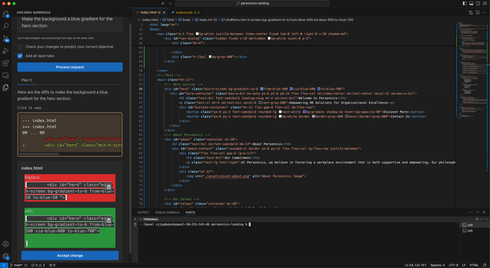
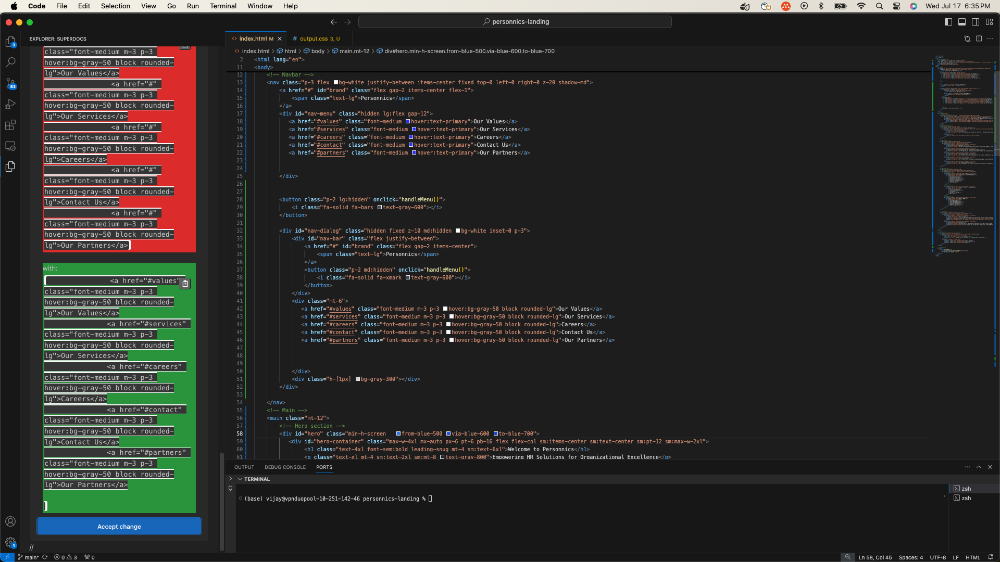
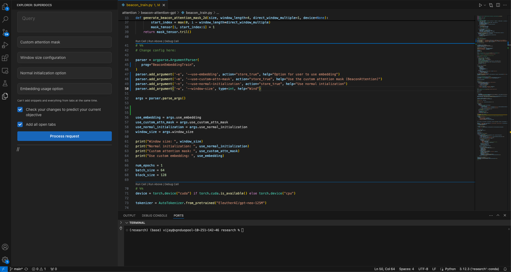

Bun backend has the backend code written for Bun. However, the regular backend folder is being used for Vercel Serverless functions. The extension codebase is in the extension folder, with the webview that the user interacts with in extension/webview.

Check out the [Python version](https://github.com/vdaita/superdocs-python), which implements several other cool features for the command line!

At worst, Superdocs should give you the sort of response that GPT-4 gives you. At best, Superdocs will make difficult or cumbersome changes quick, easy, and seamless. 
This project is heavily inspired by [Aider](https://aider.chat). 

Things I've tried that haven't worked that well:
- Paralellizing edit requests: this didn't work as well as expected because edit changes would be too close to each other, leading to different threads trying to edit the same part of code. Removed because of high cost.
- Guessing what changes are trying to be made using Llama models: the candidate generations aren't as great as I'd like them to be, but it's a cool concept and relatively cheap.

I used Supabase for authentication with a backend, but it should be pretty easy to run Superdocs locally (albeit from the extension host). Raise an issue or send me an email if you'd like to be invited to the application.

## Screenshots

